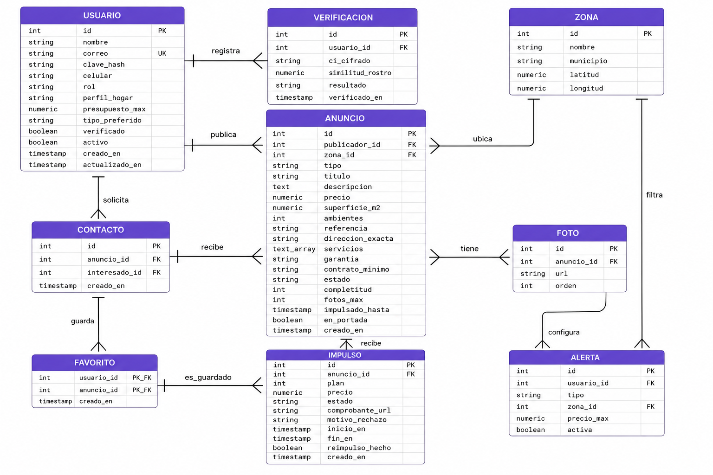

# Base de datos — VintoAlquiler

## Diagrama Entidad-Relación

## Diccionario de datos

### Tabla USUARIO

| Campo | Tipo | Restricción | Descripción |
|---|---|---|---|
| id | int | PK, autoincremental | Identificador único del usuario |
| nombre | string | NOT NULL | Nombre completo |
| correo | string | UNIQUE, NOT NULL | Correo electrónico de acceso |
| clave_hash | string | NOT NULL | Contraseña cifrada con bcrypt |
| celular | string | NOT NULL | Número de WhatsApp |
| rol | string | NOT NULL, ENUM(interesado, publicador, admin) | Rol del usuario |
| perfil_hogar | string | NULLABLE | Perfil de convivencia (solo interesados) |
| presupuesto_max | numeric | NULLABLE | Presupuesto mensual máximo (solo interesados) |
| tipo_preferido | string | NULLABLE | Tipo de inmueble preferido (solo interesados) |
| verificado | boolean | DEFAULT false | Estado de verificación de identidad |
| activo | boolean | DEFAULT true | Habilita/suspende la cuenta |
| creado_en | timestamp | DEFAULT now() | Fecha de registro |
| actualizado_en | timestamp | AUTO UPDATE | Última modificación |

### Tabla VERIFICACION

| Campo | Tipo | Restricción | Descripción |
|---|---|---|---|
| id | int | PK, autoincremental | Identificador del intento de verificación |
| usuario_id | int | FK → usuario.id | Usuario que se verifica |
| ci_cifrado | string | NOT NULL | Número de CI cifrado (AES-256-CBC) |
| similitud_rostro | numeric | NULLABLE | Porcentaje devuelto por Amazon Rekognition |
| resultado | string | NOT NULL, ENUM(aprobado, rechazado) | Resultado del intento |
| verificado_en | timestamp | DEFAULT now() | Fecha del intento |

### Tabla ZONA

| Campo | Tipo | Restricción | Descripción |
|---|---|---|---|
| id | int | PK, autoincremental | Identificador de la zona |
| nombre | string | NOT NULL | Nombre de la zona |
| municipio | string | DEFAULT 'Vinto' | Municipio al que pertenece |
| latitud | numeric | NOT NULL | Coordenada de latitud |
| longitud | numeric | NOT NULL | Coordenada de longitud |

### Tabla ANUNCIO

| Campo | Tipo | Restricción | Descripción |
|---|---|---|---|
| id | int | PK, autoincremental | Identificador del anuncio |
| publicador_id | int | FK → usuario.id | Usuario que publica |
| zona_id | int | FK → zona.id | Zona del inmueble |
| tipo | string | NOT NULL, ENUM(cuarto, garzonier, departamento) | Modalidad del alquiler |
| titulo | string | NOT NULL | Título del anuncio |
| descripcion | text | NULLABLE | Descripción detallada |
| precio | numeric | NOT NULL | Precio mensual en Bs. |
| superficie_m2 | numeric | NULLABLE | Superficie en m² |
| ambientes | int | NULLABLE | Número de ambientes |
| referencia | string | NULLABLE | Ubicación aproximada (pública) |
| direccion_exacta | string | NULLABLE | Dirección exacta (solo verificados) |
| servicios | text_array | NULLABLE | Servicios incluidos |
| garantia | string | NULLABLE | Condición de garantía |
| contrato_minimo | string | NULLABLE | Duración mínima del contrato |
| estado | string | DEFAULT 'disponible', ENUM(disponible, ocupado, pausado) | Estado del anuncio |
| completitud | int | DEFAULT 0 | Porcentaje de información completada |
| fotos_max | int | DEFAULT 5 | Límite de fotos según plan |
| impulsado_hasta | timestamp | NULLABLE | Fecha de vencimiento del Impulso activo |
| en_portada | boolean | DEFAULT false | Aparece en sección Destacados |
| creado_en | timestamp | DEFAULT now() | Fecha de publicación |

### Tabla FOTO

| Campo | Tipo | Restricción | Descripción |
|---|---|---|---|
| id | int | PK, autoincremental | Identificador de la foto |
| anuncio_id | int | FK → anuncio.id, ON DELETE CASCADE | Anuncio al que pertenece |
| url | string | NOT NULL | URL en Cloudflare R2 |
| orden | int | DEFAULT 0 | Orden de visualización |

### Tabla CONTACTO

| Campo | Tipo | Restricción | Descripción |
|---|---|---|---|
| id | int | PK, autoincremental | Identificador del contacto |
| anuncio_id | int | FK → anuncio.id, ON DELETE CASCADE | Anuncio contactado |
| interesado_id | int | FK → usuario.id | Interesado que solicita contacto |
| creado_en | timestamp | DEFAULT now() | Fecha de la solicitud |

### Tabla FAVORITO

| Campo | Tipo | Restricción | Descripción |
|---|---|---|---|
| usuario_id | int | PK compuesta, FK → usuario.id | Usuario que guarda |
| anuncio_id | int | PK compuesta, FK → anuncio.id | Anuncio guardado |
| creado_en | timestamp | DEFAULT now() | Fecha de guardado |

### Tabla ALERTA

| Campo | Tipo | Restricción | Descripción |
|---|---|---|---|
| id | int | PK, autoincremental | Identificador de la alerta |
| usuario_id | int | FK → usuario.id, ON DELETE CASCADE | Usuario propietario |
| tipo | string | NULLABLE | Tipo de inmueble filtrado |
| zona_id | int | FK → zona.id, NULLABLE | Zona filtrada |
| precio_max | numeric | NULLABLE | Precio máximo filtrado |
| activa | boolean | DEFAULT true | Estado de la alerta |

### Tabla IMPULSO

| Campo | Tipo | Restricción | Descripción |
|---|---|---|---|
| id | int | PK, autoincremental | Identificador del impulso |
| anuncio_id | int | FK → anuncio.id, ON DELETE CASCADE | Anuncio impulsado |
| plan | int | NOT NULL, ENUM(7, 15, 30) | Duración del plan en días |
| precio | numeric | NOT NULL | Precio del plan en Bs. |
| estado | string | DEFAULT 'pendiente', ENUM(pendiente, activo, rechazado, vencido) | Estado del impulso |
| comprobante_url | string | NOT NULL | URL del comprobante de pago |
| motivo_rechazo | string | NULLABLE | Motivo si fue rechazado |
| inicio_en | timestamp | NULLABLE | Fecha de inicio del impulso |
| fin_en | timestamp | NULLABLE | Fecha de fin del impulso |
| reimpulso_hecho | boolean | DEFAULT false | Si ya se aplicó el reimpulso automático |
| creado_en | timestamp | DEFAULT now() | Fecha de la solicitud |
