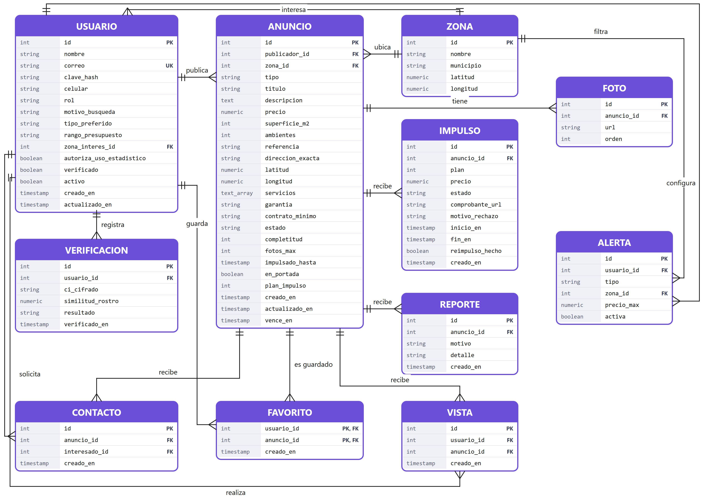

# Base de datos — VintoAlquiler

## Diagrama Entidad-Relación

La base de datos tiene 11 tablas en PostgreSQL, creadas por TypeORM a partir de las entidades del backend.

**Convención de nombres.** En el diagrama y en este diccionario los campos se escriben en *snake_case*
(por ejemplo, `publicador_id`) para facilitar la lectura. En la base de datos, TypeORM genera los mismos
campos en *camelCase* (por ejemplo, `publicadorId`); el significado y el tipo son idénticos.

**Campos protegidos.** `usuario.clave_hash`, `usuario.celular`, `anuncio.direccion_exacta`,
`anuncio.latitud` y `anuncio.longitud` no se cargan por defecto en las consultas: el backend solo los lee
donde son necesarios y nunca los envía a quien no tiene permiso.

## Diccionario de datos

### Tabla USUARIO

| Campo | Tipo | Restricción | Descripción |
|---|---|---|---|
| id | int | PK, autoincremental | Identificador único del usuario |
| nombre | string | NOT NULL | Nombre completo |
| correo | string | UNIQUE, NOT NULL | Correo electrónico de acceso |
| clave_hash | string | NOT NULL, protegido | Contraseña cifrada con bcrypt |
| celular | string | NOT NULL, protegido | Número de WhatsApp (solo se usa para generar el enlace de contacto) |
| rol | string | NOT NULL, ENUM(interesado, publicador, admin) | Rol del usuario |
| motivo_busqueda | string | NULLABLE | Motivo de búsqueda (solo interesados) |
| tipo_preferido | string | NULLABLE | Tipo de inmueble preferido (solo interesados) |
| rango_presupuesto | string | NULLABLE, ENUM(hasta_500, 501_800, 801_1200, mas_1200) | Rango de presupuesto mensual (solo interesados) |
| zona_interes_id | int | FK → zona.id, NULLABLE | Zona de interés (solo interesados) |
| autoriza_uso_estadistico | boolean | DEFAULT false | Consentimiento para usar sus preferencias en el Observatorio |
| verificado | boolean | DEFAULT false | Estado de verificación de identidad |
| activo | boolean | DEFAULT true | Habilita o suspende la cuenta |
| creado_en | timestamp | DEFAULT now() | Fecha de registro |
| actualizado_en | timestamp | AUTO UPDATE | Última modificación |

### Tabla VERIFICACION

| Campo | Tipo | Restricción | Descripción |
|---|---|---|---|
| id | int | PK, autoincremental | Identificador del intento de verificación |
| usuario_id | int | FK → usuario.id, NOT NULL | Usuario que se verifica |
| ci_cifrado | string | NOT NULL | Número de CI cifrado (AES-256-CBC) |
| similitud_rostro | numeric | NULLABLE | Porcentaje de similitud devuelto por Amazon Rekognition |
| resultado | string | NOT NULL, ENUM(aprobado, rechazado) | Resultado del intento |
| verificado_en | timestamp | DEFAULT now() | Fecha del intento |

### Tabla ZONA

| Campo | Tipo | Restricción | Descripción |
|---|---|---|---|
| id | int | PK, autoincremental | Identificador de la zona |
| nombre | string | NOT NULL | Nombre de la zona |
| municipio | string | DEFAULT 'Vinto' | Municipio al que pertenece |
| latitud | numeric | NULLABLE | Latitud del centro de la zona |
| longitud | numeric | NULLABLE | Longitud del centro de la zona |

### Tabla ANUNCIO

| Campo | Tipo | Restricción | Descripción |
|---|---|---|---|
| id | int | PK, autoincremental | Identificador del anuncio |
| publicador_id | int | FK → usuario.id, NOT NULL | Usuario que publica |
| zona_id | int | FK → zona.id, NOT NULL | Zona del inmueble |
| tipo | string | NOT NULL, ENUM(cuarto, garzonier, departamento) | Tipo de inmueble |
| titulo | string | NOT NULL | Título del anuncio (10 a 80 caracteres) |
| descripcion | text | NOT NULL | Descripción (30 a 1.000 caracteres, sin teléfonos ni enlaces) |
| precio | numeric | NOT NULL | Precio mensual en Bs. |
| superficie_m2 | int | NULLABLE | Superficie aproximada en m² |
| ambientes | int | NULLABLE | Número de ambientes |
| referencia | string | NOT NULL | Punto de referencia público |
| direccion_exacta | string | NOT NULL, protegido | Dirección exacta (solo interesados verificados, el publicador y el admin) |
| latitud | numeric | NULLABLE, protegido | Latitud exacta marcada en el mapa (el público recibe una ubicación aproximada) |
| longitud | numeric | NULLABLE, protegido | Longitud exacta marcada en el mapa (el público recibe una ubicación aproximada) |
| servicios | text_array | NOT NULL, DEFAULT '{}' | Servicios (incluidos en el precio o con pago aparte) y características del inmueble |
| garantia | string | NOT NULL | Garantía solicitada |
| contrato_minimo | string | NOT NULL | Tiempo mínimo de alquiler |
| estado | string | DEFAULT 'disponible', ENUM(disponible, ocupado, pausado) | Estado del anuncio |
| completitud | int | DEFAULT 0 | Porcentaje de información completada |
| fotos_max | int | DEFAULT 15 | Límite de fotos según el plan (15 gratuito; 20, 25 o 30 con Impulso) |
| impulsado_hasta | timestamp | NULLABLE | Fecha de fin del Impulso activo |
| en_portada | boolean | DEFAULT false | Aparece en la sección Destacados |
| plan_impulso | int | NULLABLE, ENUM(7, 15, 30) | Plan de Impulso activo (define el sello visible) |
| creado_en | timestamp | DEFAULT now() | Fecha de publicación |
| actualizado_en | timestamp | AUTO UPDATE | Última modificación |
| vence_en | timestamp | NULLABLE | Fecha en que se pausa por inactividad (60 días) |

### Tabla FOTO

| Campo | Tipo | Restricción | Descripción |
|---|---|---|---|
| id | int | PK, autoincremental | Identificador de la foto |
| anuncio_id | int | FK → anuncio.id, NOT NULL, ON DELETE CASCADE | Anuncio al que pertenece |
| url | string | NOT NULL | URL en Cloudflare R2 |
| orden | int | DEFAULT 0 | Orden de visualización (la foto de orden 0 es la portada) |

### Tabla CONTACTO

| Campo | Tipo | Restricción | Descripción |
|---|---|---|---|
| id | int | PK, autoincremental | Identificador del contacto |
| anuncio_id | int | FK → anuncio.id, NOT NULL, ON DELETE CASCADE | Anuncio contactado |
| interesado_id | int | FK → usuario.id, NOT NULL | Interesado que solicita el contacto |
| creado_en | timestamp | DEFAULT now() | Fecha de la solicitud |

### Tabla FAVORITO

| Campo | Tipo | Restricción | Descripción |
|---|---|---|---|
| usuario_id | int | PK compuesta, FK → usuario.id, ON DELETE CASCADE | Usuario que guarda |
| anuncio_id | int | PK compuesta, FK → anuncio.id, ON DELETE CASCADE | Anuncio guardado |
| creado_en | timestamp | DEFAULT now() | Fecha de guardado |

### Tabla ALERTA

| Campo | Tipo | Restricción | Descripción |
|---|---|---|---|
| id | int | PK, autoincremental | Identificador de la alerta |
| usuario_id | int | FK → usuario.id, NOT NULL, ON DELETE CASCADE | Usuario propietario |
| tipo | string | NULLABLE | Tipo de inmueble filtrado (vacío = todos) |
| zona_id | int | FK → zona.id, NULLABLE | Zona filtrada (vacía = todas) |
| precio_max | numeric | NULLABLE | Precio máximo filtrado |
| activa | boolean | DEFAULT true | Estado de la alerta |

### Tabla IMPULSO

| Campo | Tipo | Restricción | Descripción |
|---|---|---|---|
| id | int | PK, autoincremental | Identificador del impulso |
| anuncio_id | int | FK → anuncio.id, NOT NULL, ON DELETE CASCADE | Anuncio impulsado |
| plan | int | NOT NULL, ENUM(7, 15, 30) | Duración del plan en días |
| precio | numeric | NOT NULL | Precio del plan en Bs. |
| estado | string | DEFAULT 'pendiente', ENUM(pendiente, activo, rechazado, vencido) | Estado del impulso |
| comprobante_url | string | NOT NULL | URL del comprobante de pago |
| motivo_rechazo | string | NULLABLE | Motivo si fue rechazado |
| inicio_en | timestamp | NULLABLE | Fecha de inicio del impulso |
| fin_en | timestamp | NULLABLE | Fecha de fin del impulso |
| reimpulso_hecho | boolean | DEFAULT false | Si ya se aplicó el reimpulso automático |
| creado_en | timestamp | DEFAULT now() | Fecha de la solicitud |

### Tabla REPORTE

| Campo | Tipo | Restricción | Descripción |
|---|---|---|---|
| id | int | PK, autoincremental | Identificador del reporte |
| anuncio_id | int | FK → anuncio.id, NOT NULL, ON DELETE CASCADE | Anuncio reportado |
| motivo | string | NOT NULL, ENUM(Información falsa, Precio incorrecto, Imagen que no corresponde, Anuncio duplicado, Posible estafa, Inmueble ya alquilado, Otro) | Motivo seleccionado |
| detalle | string | NULLABLE | Detalle opcional (hasta 500 caracteres) |
| creado_en | timestamp | DEFAULT now() | Fecha del reporte |

### Tabla VISTA

| Campo | Tipo | Restricción | Descripción |
|---|---|---|---|
| id | int | PK, autoincremental | Identificador de la vista |
| usuario_id | int | FK → usuario.id, NOT NULL, ON DELETE CASCADE | Interesado que vio el anuncio |
| anuncio_id | int | FK → anuncio.id, NOT NULL, ON DELETE CASCADE | Anuncio visto |
| creado_en | timestamp | DEFAULT now() | Fecha de la vista (historial para recomendaciones) |

## Relaciones

| Relación | Cardinalidad | Descripción |
|---|---|---|
| USUARIO → ANUNCIO | 1 : N | Un publicador publica muchos anuncios |
| ZONA → ANUNCIO | 1 : N | Una zona contiene muchos anuncios |
| ANUNCIO → FOTO | 1 : N | Un anuncio tiene muchas fotos |
| USUARIO → VERIFICACION | 1 : N | Un usuario registra varios intentos de verificación |
| USUARIO → CONTACTO | 1 : N | Un interesado solicita muchos contactos |
| ANUNCIO → CONTACTO | 1 : N | Un anuncio recibe muchos contactos |
| USUARIO ↔ ANUNCIO (FAVORITO) | N : M | Un interesado guarda muchos anuncios y un anuncio es guardado por muchos |
| USUARIO → ALERTA | 1 : N | Un interesado configura muchas alertas |
| ZONA → ALERTA | 1 : N | Una zona filtra muchas alertas (opcional) |
| ANUNCIO → IMPULSO | 1 : N | Un anuncio recibe muchos impulsos en el tiempo |
| ANUNCIO → REPORTE | 1 : N | Un anuncio recibe muchos reportes |
| USUARIO → VISTA y ANUNCIO → VISTA | 1 : N | Historial de anuncios vistos por cada interesado |
| ZONA → USUARIO | 1 : N | Zona de interés del interesado (opcional) |
